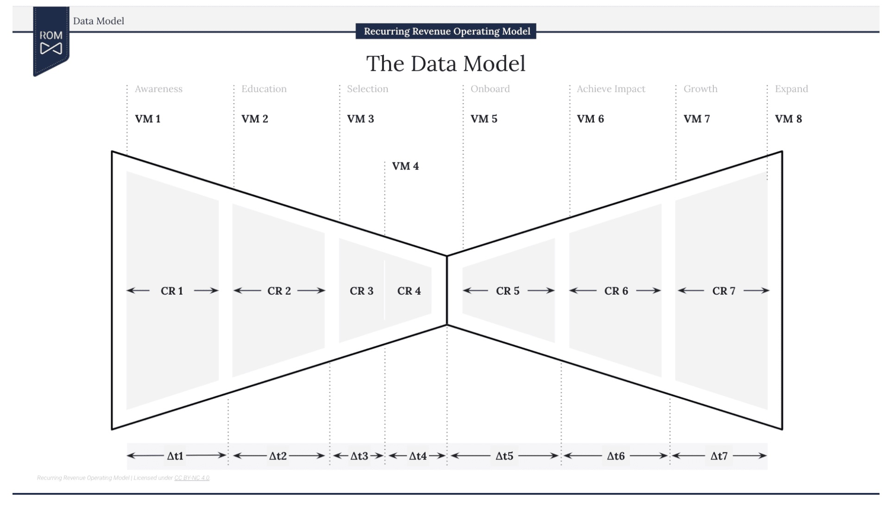

# Bowtie dbt Template

A dbt (data build tool) project template for transforming HubSpot CRM data into actionable analytics models.

## Overview

<p align="center">
  
</p>

This project provides a structured approach to transform raw HubSpot data into analytics-ready models, focusing on:

- Customer journey analytics
- Velocity metrics tracking
- Conversion rate analysis
- Customer retention metrics

## Project Structure

```
models/
├── analytics/
│   └── a_creation.sql             # Final analytics models
├── intermediate/
│   └── hubspot/                   # Intermediate transformations
│       ├── int_t1_awareness.sql
│       ├── int_t2_education.sql
│       ├── int_t3_onboarding.sql
│       └── int_vm_.sql            # Various velocity metrics
└── staging/
    └── hubspot/                   # Initial data staging
        ├── stg_companies.sql
        ├── stg_contacts.sql
        └── stg_deals.sql
```

## Models

### Staging Models
- `stg_companies`: Clean company data from HubSpot
- `stg_contacts`: Clean contact data with lifecycle stages
- `stg_deals`: Clean deal data with revenue metrics

### Intermediate Models
- Velocity Metrics (`int_vm_*`)
  - Creation
  - Awareness
  - Education
  - Consideration
  - Onboarding
  - Impact

- Time-to-Convert Metrics (`int_t*`)
  - T1: Awareness to Education
  - T2: Education to Consideration
  - T3: Consideration to Close

### Analytics Models
- `a_creation`: Consolidated view of all metrics including:
  - Conversion rates between stages
  - Volume metrics per stage
  - Time-to-convert metrics
  - Retention metrics

## Getting Started

1. Create and activate a virtual environment:
   ```bash
   # Create a virtual environment
   python -m venv dbt_env
   
   # Create activation script
   cat > activate_env.sh << 'EOF'
   #!/usr/bin/env bash
   source dbt_env/bin/activate
   # export DBT_PROFILES_DIR=.
   EOF
   
   # Make it executable
   chmod +x activate_env.sh
   
   # Activate the environment
   source activate_env.sh
   ```

2. Install dbt:
   ```bash
   pip install dbt-core dbt-bigquery
   ```

3. Configure your profile:
   ```yaml
   default:
     outputs:
       dev:
         type: bigquery
         project: your-project
         dataset: your_dataset
         location: your-location
     target: dev
   ```

4. Install dependencies:
   ```bash
   dbt deps
   ```

5. Verify your setup:
   ```bash
   dbt debug
   ```

### Development Workflow

1. Always activate your environment before working:
   ```bash
   source activate_env.sh
   ```

2. Run your models:
   ```bash
   dbt run
   ```

## Testing

Run the included tests:

bash
dbt test


## Documentation

Generate and view documentation:

bash
dbt docs generate
dbt docs serve

## Contributing

1. Fork the repository
2. Create a feature branch
3. Commit your changes
4. Push to the branch
5. Create a Pull Request

## License

[Here](./LICENSE.md)