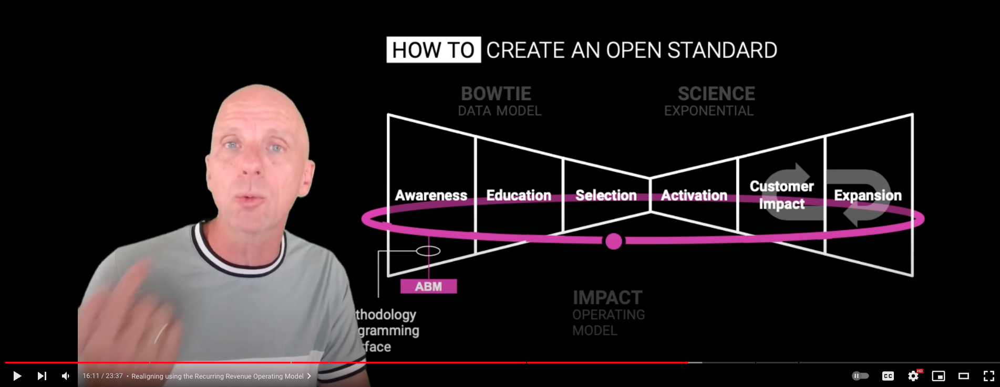

# Bowtie dbt Template

A dbt (data build tool) project template for transforming HubSpot CRM data into actionable analytics models. This template helps organizations build a unified view of their customer journey and business performance metrics across all departments.

This project was created by a data professional with a background in revenue operations and as a [Certified Revenue Architect](https://credentials.winningbydesign.com/37564c7b-d069-4cdd-b5de-c0247c284b9d#acc.szFAQmjx) by Winning by Design. The methodology and structure are directly informed by real-world application of these principles across multiple organizations.

Personal [LinkedIn publication](https://www.linkedin.com/feed/update/urn:li:activity:7114872202654543872/) related to this project.
## Project Vision

The Bowtie Analytics Template creates a seamless, data-driven approach to understanding your business performance end-to-end. By integrating data from marketing, sales, customer success, and product teams, it provides a holistic view of your entire customer lifecycle, enabling better decision-making and strategic alignment.

Built on modern data stack principles, this template utilizes dbt to transform raw HubSpot data into analytics-ready models that can be easily consumed by visualization tools, making complex data accessible to all stakeholders.

## Streamlit Application Preview

<p align="center">
  
</p>

The accompanying Streamlit application provides an interactive interface for exploring the analytics models generated by this dbt project. It allows users to:

- Filter data by custom date ranges
- Segment performance metrics by various dimensions
- Track progress against OKRs and KPIs over time
- Visualize conversion funnels and customer journey metrics
- Generate automated reports for stakeholder meetings

By enriching all companies and reverse-engineering your revenue across funnel conversions, you can calculate in real time what the pipeline value is in each stage of the customer journey. This capability is essential since even if conversion, volume, and velocity metrics all decline, an increasing expected revenue still indicates positive business performance. This approach also shifts focus away from traditional metrics like MQL volume or marketing-generated contacts, providing a more holistic view of business health through revenue impact at each journey stage.

While the Winning by Design bow-tie model provides a solid framework, it becomes truly powerful when you can track each stage over time to observe progression and trends. This template enhances the static model by enabling historical analysis and time-series comparisons. Additionally, the ability to filter metrics by various customer segments allows you to compare performance across different market segments, industries, or account types - unlocking strategic insights about which customer profiles deliver the highest value and how their journeys differ. This segmentation capability dramatically improves strategic decision-making by revealing which parts of your business deserve more focus and investment.

## Overview

<p align="center">
  
</p>

This project provides a structured approach to transform raw HubSpot data into analytics-ready models, enabling a holistic, end-to-end view of your organization's performance. By leveraging the [Winning by Design framework](https://youtu.be/XCRtEVsTXsc?si=7noSFNSuleXw9V1P&t=833), it unifies data across all teams into an actionable operating model.

<p align="center">
  <a href="https://youtu.be/XCRtEVsTXsc?si=7noSFNSuleXw9V1P&t=833">
    
  </a>
</p>

### Strategic Impact

- **Cross-functional Alignment**: Bridges data silos between Marketing, Sales, Customer Success, and Product teams
- **Decision Support**: Facilitates data-driven strategic decision-making at all organizational levels
- **Performance Optimization**: Enables continuous improvement through comprehensive KPI tracking and analysis
- **Revenue Intelligence**: Generate actionable insights for revenue growth and customer success
- **Customer Journey Optimization**: Identify friction points and opportunities throughout the customer lifecycle

### Reverse Engineering Success

This model employs a reverse engineering approach to optimize company performance by:
- **Starting at Impact**: Understanding what defines successful customers and their long-term value
- **Working Backwards**: Mapping the critical touchpoints and decisions that lead to customer success
- **Identifying Patterns**: Recognizing common paths and behaviors of high-value customers
- **Optimizing Journey**: Refining each stage of the customer journey based on successful outcomes
- **Scaling Success**: Implementing repeatable processes based on proven customer success patterns

### Key Focus Areas

- Customer journey analytics
- Velocity metrics tracking
- Conversion rate analysis
- Customer retention metrics
- Multi-touch attribution
- Growth levers identification
- Performance benchmarking

### Operational Benefits

- **Strategic Planning**: Identify opportunities and challenges across the entire customer lifecycle
- **Resource Allocation**: Make informed decisions about team and project prioritization
- **Performance Tracking**: Monitor and optimize key metrics across all business units
- **Predictive Intelligence**: Forecast future performance based on leading indicators
- **Team Collaboration**: Create a shared data language across departments

### Roadmap & Future Integrations

#### Marketing Analytics Integration
- [ ] **Paid Advertising**: LinkedIn, Facebook, Google/GA4 Ads (Basics)
- [ ] **Web Analytics**
- [ ] **Marketing Campaign Attribution**: Dreamdata for out-of-the-box B2B attribution (Advanced)

#### Financial Data Integration
- [ ] **Chargebee**: 
  - [ ] MRR/ARR analytics
  - [ ] Customer lifetime value calculations
  - [ ] Cohorts & Churn models

### OKR Reporting
- [ ] **Streamlit Application**:
  - Date range selections: Weekly, monthly, quarterly views
  - Dynamic Report: Industry verticals, Company size, Geographic regions, Deal value tiers, ...
  - Performance metrics: Value, velocity, volume, conversion
  - Reporting: Google Sheets OKR Meeting Report, Operational Hubspot Embedded Dashboards

## Project Structure

```
models/
├── analytics/
│   └── a_creation.sql             # Final analytics models
├── intermediate/
│   └── hubspot/                   # Intermediate transformations
│       ├── int_t1_awareness.sql
│       ├── int_t2_education.sql
│       ├── int_t3_onboarding.sql
│       └── int_vm_.sql            # Various velocity metrics
└── staging/
    └── hubspot/                   # Initial data staging
        ├── stg_companies.sql
        ├── stg_contacts.sql
        └── stg_deals.sql
```

## Models

### Staging Models
- `stg_companies`: Clean company data from HubSpot
- `stg_contacts`: Clean contact data with lifecycle stages
- `stg_deals`: Clean deal data with revenue metrics

### Intermediate Models
- Velocity Metrics (`int_vm_*`)
  - Creation
  - Awareness
  - Education
  - Consideration
  - Onboarding
  - Impact

- Time-to-Convert Metrics (`int_t*`)
  - T1: Awareness to Education
  - T2: Education to Consideration
  - T3: Consideration to Close

### Analytics Models
- `a_creation`: Consolidated view of all metrics including:
  - Conversion rates between stages
  - Volume metrics per stage
  - Time-to-convert metrics
  - Retention metrics

## Getting Started

1. Create and activate a virtual environment:
   ```bash
   # Create a virtual environment
   python -m venv dbt_env
   
   # Create activation script
   cat > activate_env.sh << 'EOF'
   #!/usr/bin/env bash
   source dbt_env/bin/activate
   # export DBT_PROFILES_DIR=.
   EOF
   
   # Make it executable
   chmod +x activate_env.sh
   
   # Activate the environment
   source activate_env.sh
   ```

2. Install dbt:
   ```bash
   pip install dbt-core dbt-bigquery
   ```

3. Configure your profile:
   ```yaml
   default:
     outputs:
       dev:
         type: bigquery
         project: your-project
         dataset: your_dataset
         location: your-location
     target: dev
   ```

4. Install dependencies:
   ```bash
   dbt deps
   ```

5. Verify your setup:
   ```bash
   dbt debug
   ```

### Development Workflow

1. Always activate your environment before working:
   ```bash
   source activate_env.sh
   ```

2. Run your models:
   ```bash
   dbt run
   ```

## Testing

Run the included tests:

```bash
dbt test
```

## Documentation

Generate and view documentation:

```bash
dbt docs generate
dbt docs serve
```

## Contributing

1. Fork the repository
2. Create a feature branch
3. Commit your changes
4. Push to the branch
5. Create a Pull Request

## License (IMPORTANT)
[Here](https://github.com/wukimidaire/dbt_bowtie_template/blob/main/LICENSE.md)
